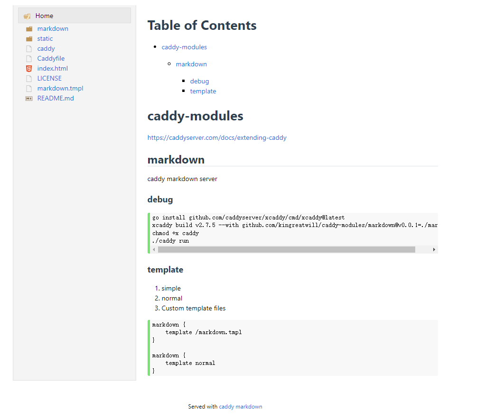

# caddy-modules

https://caddyserver.com/docs/extending-caddy

## markdown
caddy markdown server

### debug


```
export SENTRY_DSN="xx"
export SENTRY_DEBUG="true"
go install github.com/caddyserver/xcaddy/cmd/xcaddy@latest
xcaddy build v2.7.5 --with github.com/kingreatwill/caddy-modules/markdown@v0.0.1=./markdown \
  --with github.com/kingreatwill/caddy-modules/tracing-sentry@v0.0.1=./tracing-sentry \
  --with github.com/kingreatwill/caddy-modules/admin-ui@v0.0.1=./admin-ui \
  --with github.com/kingreatwill/caddy-modules/search@v0.0.1=./search
chmod +x caddy
./caddy run
```

### template
1. simple
2. normal
3. Custom template files
```
markdown {
    template /markdown.tmpl
}

markdown {
    template normal
}
```

### preview

https://note.wcoder.com/



### TODO
- [ ] 增加在线人数
- [ ] 文件访问次数
- [ ] 显示创建和修改时间
- [ ] 显示git提交信息和diff
- [ ] 排除文件夹
- [x] 隐藏文件(目前默认以.和_开头的文件不显示)
- [x] SEO
- [ ] markdown插件可配置
- [ ] sitemap
- [ ] 定时更新根目录
- [ ] 留言回复(可以对接到issue)

#### 显示创建和修改时间
```bash
# 获取 git 仓库中所有文件的最新修改时间
$ git ls-tree -r --name-only HEAD | while read filename; do
> echo "$(git log -1 --pretty=format:"%ad" -- $filename) $filename";
> done
# 获取 git 仓库中所有文件的最初创建时间
$ git ls-tree -r --name-only HEAD | while read filename; do
> echo "$(git log --pretty=format:"%ad" -- $filename | tail -1) $filename";
> done
```

> [How to retrieve the last modification date of all files in a Git repository](https://serverfault.com/questions/401437/how-to-retrieve-the-last-modification-date-of-all-files-in-a-git-repository/401450#401450)

> [Finding the date/time a file was first added to a Git repository](https://stackoverflow.com/questions/2390199/finding-the-date-time-a-file-was-first-added-to-a-git-repository/2390382#2390382)

#### crontab
定时更新根目录
```sh
#!/bin/bash  

(date "+%Y-%m-%d %H:%M:%S")
cd /data/dockerv/caddy/srv/note.wcoder.com
git pull


# 
# crontab -e
# 0 0 * * * sh /root/code/crontab.sh >> /root/code/crontab.log
```
